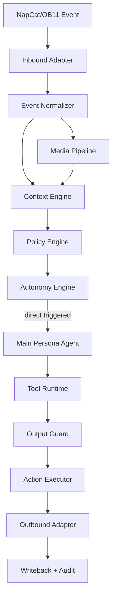
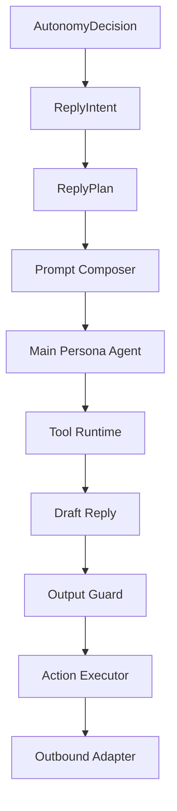

# QQ 群友 AI Bot 全新架构设计文档

版本：vNext  
定位：从零设计，不兼容旧实现  
技术栈：Go + Eino ADK/Compose + NapCat/OneBot 11 + MySQL + Qdrant + Redis + MinIO

---

## 一、总体设计结论

### 1.1 结论

这不是一个“有人问才回答”的问答 Bot，而是一个长期在线、能观察群聊、具备稳定人格、能理解多模态内容、能自主决定是否发言的 AI 群成员。

最合理的总体架构不是单 Agent，也不是全 Agent 化，而是：

- `确定性 Runtime Kernel`
- `前台多 Agent 协作`
- `后台学习与画像 Agent`
- `规则 + LLM 混合决策`
- `事件驱动 + 状态机 + 策略引擎`

核心结论如下：

- `人格` 必须是一级系统能力，因为它不仅影响 prompt 文案，还影响说话概率、回复长度、调侃阈值、互动距离、表情包策略。
- `自主决策` 必须是一级系统能力，因为它决定 Bot 是否发声、何时发声、用什么模式发声，不属于回复生成的附属逻辑。
- `多模态` 必须是一级系统能力，因为图片、表情包、视频不仅影响回复文本，还影响主动插话、记忆写入、画像更新与表情包复用。
- `状态机和限流` 不能交给 LLM。LLM 负责语义理解和生成，运行时负责边界、频率、权限、可解释性。
- `多 Agent` 只用于高延迟、强语义、可并行或可异步的任务，不用于替代整个运行时。

### 1.2 为什么它不是普通问答 Bot

普通问答 Bot 的主问题是：

- 用户问了什么
- 应该怎么回答

这个系统的主问题是：

- 这句是不是在 cue Bot
- 现在该不该说话
- 说一句会不会抢群友话题
- 这张图是不是梗图
- 这个群当前更适合热闹还是安静
- 对这个人应该熟一点还是收一点
- 这件事值不值得记住
- 最近这个群的新黑话是不是该学

因此，它本质上是一个“持续感知 + 决策 + 表达 + 学习”的群内参与系统，而不是简单的“输入输出函数”。

### 1.3 为什么采用非对称多 Agent

单 Agent 同时处理：

- 实时回复
- 主动插话判断
- 多模态理解
- 长期记忆提炼
- 群友画像更新
- 黑话学习

会有几个问题：

- 上下文过宽，prompt 不稳定
- 时延不可控
- 成本高
- 各任务目标冲突
- 很难做权限与边界控制

因此采用非对称多 Agent：

- 前台 Agent：服务实时对话
- 后台 Agent：服务异步学习
- Runtime Kernel：不使用 LLM，负责调度、状态、权限、策略、审计

### 1.4 总体架构风格与取舍

#### 推荐风格

- 事件驱动：一切输入输出、媒体理解、记忆写入、画像更新都抽象成事件。
- 分层架构：协议适配、运行时编排、领域服务、存储与模型 Provider 解耦。
- 策略引擎：群策略、人格策略、自主决策策略统一编译和执行。
- 状态机：观察态、显式触发、主动候选、冷却态、抑制态显式建模。
- Agent orchestration：只在需要语义规划的链路使用 Agent 或 Compose Graph。
- 规则 + LLM 混合：规则负责边界，LLM 负责语义和表达。

#### 明确不采用

- 不采用“所有事情都交给一个大 Agent”。
- 不采用“所有模块都做成微服务”。
- 不采用“人格只存在于 system prompt”。
- 不采用“每条消息都走完整 Agent 流程”。

### 1.5 最终架构结论

推荐整体形态：

- `模块化单体` 作为第一阶段落地形态
- `进程内事件总线` 作为第一阶段消息编排
- `前台 3 Agent + 后台 2 Agent`
- `MySQL` 作为主存
- `Qdrant` 作为语义/多模态检索索引
- `Redis` 作为运行时状态、限流和短期缓存
- `MinIO` 作为媒体对象存储

### 1.6 Eino 落地约束

结合 `eino-adk`、`eino-compose`、`eino-components` 的能力边界，这套方案需要补一个明确约束：

- `Main Persona Agent` 适合用 `adk.ChatModelAgent + Runner` 落地，因为它需要受控工具调用和回合式决策。
- `Gate Agent` 不适合强行做成 ADK Agent。它更适合直接用 `BaseChatModel.Generate` 做低成本结构化判断。
- `Vision Agent` 也不适合走 ADK ReAct。它更适合直接调用多模态 `ChatModel`，并使用 Eino 当前推荐的 `UserInputMultiContent` 输入，而不是旧的 `MultiContent`。
- `Curator Agent` 和 `Learning Agent` 本质上是后台流水线，更适合用 `compose.Workflow / Graph`，而不是用一个长 prompt 的 supervisor agent 串起来。
- 不建议让 `supervisor` 或 `parallel agent` 接管整个 Runtime Kernel。Kernel 仍然必须是确定性代码，不交给 ADK。

也就是说，Eino 在这里的最佳分工是：

- `ADK`：前台回复 Agent
- `Compose Graph / Workflow`：后台异步提炼、审核、写回流水线
- `BaseChatModel`：轻量 gate、vision、多模态判断
- `Retriever / Indexer / Embedding`：记忆和表情包索引层

---

## 二、系统模块设计

### 2.1 一级模块划分

| 模块 | 职责 | 为什么单独存在 | 规则/LLM | 状态 |
|---|---|---|---|---|
| Inbound Adapter | 接收 NapCat/OneBot 11 事件 | 隔离协议和实现差异 | 规则 | 无状态 |
| Event Normalizer | 统一领域事件模型 | 让上层不感知平台事件细节 | 规则 | 无状态 |
| Media Pipeline | 下载、缓存、抽帧、对象存储 | 避免主流程散落媒体处理逻辑 | 规则 | 轻状态 |
| Vision Agent | 产出结构化媒体理解 | 多模态理解独立治理和控成本 | LLM | 无状态 |
| Meme System | 自动采集、描述、去重、索引、检索表情包 | 表情包既是媒体资产也是可运营知识库，不能只当普通图片处理 | 混合 | 有状态 |
| Context Engine | 维护观察窗口和上下文快照 | 决策与回复共享一份上下文 | 混合 | 有状态 |
| Persona Engine | 人格编译、人格状态维护 | 人格必须从 prompt 文案升级为执行时能力 | 规则 | 有状态 |
| Policy Engine | 编译并执行群策略和运行策略 | 策略热更新与评估收口 | 规则 | 有状态 |
| Autonomy Engine | 自主发言状态机与评分决策 | 可解释、可配置、可观测的决策核心 | 规则优先 + LLM 辅助 | 有状态 |
| Gate Agent | 轻量语义门控 | 判断是否值得像群友一样接一句 | LLM | 无状态 |
| Main Persona Agent | 生成前台回复和动作意图 | 专注拟人化表达，不承担后台学习 | LLM | 无状态 |
| Action Executor | 执行发言、沉默、戳一戳、撤回等动作 | 对高风险动作做二次校验 | 规则 | 有状态 |
| Prompt Composer | 拼装多层 prompt | 限制 prompt 结构和输入面 | 规则 | 无状态 |
| Tool Runtime | 提供受控工具调用能力 | 工具和平台动作解耦 | 规则 | 轻状态 |
| Memory System | 记忆写入、检索、选择 | 长短期记忆分层治理 | 混合 | 有状态 |
| Profile System | 群友画像、关系状态维护 | 画像不是记忆的附属字段 | 混合 | 有状态 |
| Curator Agent | 异步提炼记忆和画像候选 | 不阻塞前台回复 | LLM | 无状态 |
| Learning Agent | 定时学习黑话/梗/表达方式 | 持续学习必须走后台批处理 | LLM | 无状态 |
| Review Pipeline | 审核学习结果 | 防止学脏、学偏、学一次性烂梗 | 规则 + 可选 LLM | 有状态 |
| Outbound Adapter | 发送消息、表情包、poke、撤回 | 平台动作标准化 | 规则 | 无状态 |
| Observability | 追踪、指标、审计、成本监控 | 没有观测就无法稳定调优 | 规则 | 有状态 |

### 2.2 模块协作关系

实时主链路：

1. Inbound Adapter 接收平台事件。
2. Event Normalizer 生成 `EventEnvelope`。
3. Media Pipeline 对附件做预处理。
4. Meme System 只做轻量候选标记、hash 去重和缓存命中检查，重描述与正式入库异步执行。
5. Context Engine 更新观察窗口并生成 `ContextSnapshot`。
6. Policy Engine + Autonomy Engine 做规则决策。
7. 必要时调用 Gate Agent 补充语义判断。
8. 决定需要回复后，Main Persona Agent 生成 `ReplyPlan`。
9. Tool Runtime 与 Action Executor 协作执行工具和平台动作。
10. Outbound Adapter 发送结果。
11. Memory/Profile/Meme/Observability 通过异步事件写回。

后台异步链路：

1. MySQL 中的消息归档由归档器持续写入。
2. Curator Agent 从高价值事件中提炼记忆候选与画像候选。
3. Learning Agent 按时间窗口扫描群聊语料。
4. Meme System 的离线任务重算关键词、聚类重复表情包、淘汰低质量条目。
5. Review Pipeline 审核候选后发布到记忆库、黑话库、画像库。

### 2.3 多 Agent 角色划分

#### Main Persona Agent

职责：

- 在“已经决定要说”的前提下，选择最自然的回应方式
- 产出文本、表情包、沉默、poke、撤回等动作意图
- 使用运行时工具，但不能越权

实现建议：

- 用 `adk.NewChatModelAgent` 落地
- 工具通过 `adk.ToolsConfig + compose.ToolsNodeConfig` 注入
- `search_meme`、`query_memory`、`web_search` 属于普通工具
- `speak_text`、`stay_silent`、`send_meme`、`poke_member`、`recall_recent_message` 属于终止型动作工具，建议配置为 `ReturnDirectly` 或在 Compose Graph 中作为终止动作节点
- 不建议让主 Agent 直接构造平台 payload，最终动作仍由 Action Executor 校验并落地

不负责：

- 时段控制
- 限流
- 平台权限
- 后台学习
- 主存写入判定

#### Gate Agent

职责：

- 判断这句是否真的在 cue Bot
- 判断是否有自然插话口子
- 对模糊场景给出保守建议

特点：

- 小模型或低成本模型
- 短上下文
- 只输出结构化判断，不负责生成正式回复

实现建议：

- 直接调用 `BaseChatModel.Generate`
- 输出严格受 schema 约束
- 不需要用 ADK ReAct，也不需要工具循环

#### Vision Agent

职责：

- 理解图片、表情包、视频
- 输出 `MediaDescriptor`

特点：

- 独立预算
- 独立超时
- 支持缓存

实现建议：

- 直接调用多模态 `ChatModel`
- 用户多模态输入使用 Eino 当前推荐的 `UserInputMultiContent`
- 不使用旧的 `schema.Message.MultiContent`
- 不走 ADK 工具循环

#### Curator Agent

职责：

- 从高价值回合提炼长期记忆候选
- 更新群友画像候选
- 生成关系状态更新建议

实现建议：

- 用 `compose.Workflow` 或 `compose.Graph` 构建后台流水线
- 更适合 “抽取 -> 规则校验 -> 写库意图” 的结构化流程

#### Learning Agent

职责：

- 批量提取黑话、梗、表达方式、稳定说话习惯
- 输出候选，交由审核流入库

实现建议：

- 用 `compose.Workflow` 承载批处理
- 需要分段采样、聚合、审核，不适合做成单轮聊天 Agent

### 2.4 无状态与有状态划分

无状态模块：

- Inbound Adapter
- Event Normalizer
- Prompt Composer
- Main Persona Agent
- Gate Agent
- Vision Agent
- Outbound Adapter

有状态模块：

- Context Engine
- Persona Engine
- Policy Engine
- Autonomy Engine
- Memory System
- Profile System
- Review Pipeline
- Observability

---

## 三、核心领域模型

```go
package domain

import "time"

type EventKind string

const (
	EventMessage EventKind = "message"
	EventNotice  EventKind = "notice"
	EventPoke    EventKind = "poke"
	EventMeta    EventKind = "meta_event"
)

type MediaKind string

const (
	MediaImage   MediaKind = "image"
	MediaSticker MediaKind = "sticker"
	MediaVideo   MediaKind = "video"
)

type AutonomyState string

const (
	StateObserving          AutonomyState = "observing"
	StateDirectTriggered    AutonomyState = "direct_triggered"
	StateProactiveCandidate AutonomyState = "proactive_candidate"
	StateCooldown           AutonomyState = "cooldown"
	StateSuppressed         AutonomyState = "suppressed"
)

type DecisionAction string

const (
	ActionSilent   DecisionAction = "silent"
	ActionReply    DecisionAction = "reply"
	ActionReact    DecisionAction = "react"
	ActionMemeOnly DecisionAction = "meme_only"
	ActionPokeBack DecisionAction = "poke_back"
	ActionRecall   DecisionAction = "recall"
)

type PersonaConfig struct {
	ID          string
	Name        string
	Aliases     []string
	Interests   []string
	SpeechStyle string
	Description string
	Constraints []string

	ReplyMaxChars     int
	ReplyMaxSentences int
	AllowTeasing      bool
	AllowQuestions    bool
	PreferMemes       bool
}

type PersonaProfile struct {
	PersonaID      string
	DisplayName    string
	StableTraits   []string
	StyleRules     []string
	AutonomyBias   map[string]float64
	InteractionMap map[string]string
	OutputRules    []string
}

type PersonaState struct {
	PersonaID  string
	GroupID    int64
	Mood       string
	Energy     string
	TalkBias   float64
	UpdatedAt  time.Time
	ExpiresAt  time.Time
}

type GroupPolicy struct {
	GroupID            int64
	Enabled            bool
	PresenceLevel      string
	PersonaOverlay     map[string]any
	ToolAllowlist      []string
	QuietHours         []string
	ActiveHours        []string
	MaxConsecutiveBot  int
	ReplyToImageChance float64
	AllowPokeBack      bool
	AllowRecall        bool
}

type AutonomyPolicy struct {
	ObserveWindowSize        int
	FollowUpWindowSec        int
	MinReplyIntervalSec      int
	ProactiveBaseProbability float64
	ProactiveScoreThreshold  float64
	MaxRepliesPer10Min       int
	MaxRepliesPerHour        int
	LLMGateEnabled           bool
	LLMGateTimeoutMs         int
	SuppressOnFlood          bool
}

type ConversationEvent struct {
	EventID           string
	GroupID           int64
	UserID            int64
	MessageID         string
	ReplyToMessageID  string
	Kind              EventKind
	Text              string
	Segments          []map[string]any
	MentionedBot      bool
	NamedBot          bool
	IsReplyToBot      bool
	Attachments       []MultimodalAttachment
	TimestampUnix     int64
}

type EventEnvelope struct {
	Source        string
	SelfID        int64
	ReceivedAt    time.Time
	RawPayload    []byte
	Event         ConversationEvent
	TraceID       string
	CorrelationID string
}

type MultimodalAttachment struct {
	AttachmentID string
	Kind         MediaKind
	URL          string
	ObjectKey    string
	MIME         string
	SizeBytes    int64
	Width        int
	Height       int
	DurationMs   int
	ContentHash  string
}

type MediaDescriptor struct {
	AttachmentID  string
	Kind          MediaKind
	Summary       string
	SceneTags     []string
	Entities      []string
	OCRTexts      []string
	EmotionHints  []string
	MemeSignals   []string
	MemeKeywords  []string
	SafetySignals []string
	Keyframes     []string
	Confidence    float64
	CostTokens    int
}

type MemeAsset struct {
	MemeID           string
	GroupID          int64
	SourceEventID    string
	ObjectKey        string
	FileExt          string
	ContentHash      string
	PerceptualHash   string
	Width            int
	Height           int
	Animated         bool
	Status           string
	CreatedAt        time.Time
}

type MemeDescriptor struct {
	MemeID           string
	Title            string
	Summary          string
	Keywords         []string
	EmotionTags      []string
	SceneTags        []string
	UsageHints       []string
	Language         string
	Confidence       float64
	Reviewed         bool
	UpdatedAt        time.Time
}

type MemeSearchResult struct {
	MemeID         string
	Score          float64
	MatchType      string
	MatchedTerms   []string
	Descriptor     MemeDescriptor
}

type ConversationContext struct {
	GroupID          int64
	ObserveWindow    []ConversationEvent
	RecentMedia      []MediaDescriptor
	ActiveTopics     []string
	LastSnapshotID   string
}

type ContextSnapshot struct {
	SnapshotID        string
	Event             ConversationEvent
	RecentTurns       []ConversationEvent
	RelevantMemories  []MemoryRecord
	MediaDescriptors  []MediaDescriptor
	MemberProfile     MemberProfile
	RelationshipState RelationshipState
	PersonaProfile    PersonaProfile
	PersonaState      PersonaState
	GroupPolicy       GroupPolicy
	RuntimeState      RuntimeState
	DecisionHints     []string
}

type AutonomyDecision struct {
	DecisionID     string
	Action         DecisionAction
	StateBefore    AutonomyState
	StateAfter     AutonomyState
	TriggerType    string
	Score          float64
	Confidence     float64
	DelayMs        int
	ReasonCodes    []string
	Explain        map[string]float64
}

type ReplyIntent struct {
	Kind              string
	Goal              string
	TargetUserIDs     []int64
	NeedClarification bool
	PreferMeme        bool
	PreferShortText   bool
	MaxChars          int
}

type ReplyPlan struct {
	PlanID             string
	Intent             ReplyIntent
	ReplyToMessageID   string
	Bubbles            []string
	PlannedTools       []string
	PlannedActions     []DecisionAction
	MemoryWriteIntents []string
	SendMode           string
	FallbackText       string
}

type ToolContext struct {
	TraceID           string
	GroupID           int64
	UserID            int64
	Intent            ReplyIntent
	AllowedTools      []string
	RetrievedMemories []MemoryRecord
	MediaDescriptors  []MediaDescriptor
	RetrievedMemes    []MemeSearchResult
	Budget            map[string]int
}

type MemoryRecord struct {
	MemoryID        string
	Scope           string
	Type            string
	Subject         string
	Content         string
	SourceEventID   string
	DescriptorRef   string
	Confidence      float64
	Importance      float64
	CreatedAt       time.Time
	ExpiresAt       *time.Time
}

type MemberStats struct {
	GroupID      int64
	UserID       int64
	Nickname     string
	MessageCount int64
	LastSpokeAt  time.Time
	ActiveScore  float64
}

type MemberTrait struct {
	GroupID         int64
	UserID          int64
	TraitType       string
	Value           string
	Confidence      float64
	EvidenceEventID string
	UpdatedAt       time.Time
	ExpiresAt       *time.Time
}

type MemberProfile struct {
	Stats      MemberStats
	Traits     []MemberTrait
	Tags       []string
	CommonPhrases []string
	Interests  []string
}

type RelationshipState struct {
	PersonaID      string
	GroupID        int64
	UserID         int64
	Familiarity    float64
	Affinity       float64
	TeaseTolerance float64
	GrudgeScore    float64
	LastInteractAt time.Time
}

type RuntimeState struct {
	GroupID             int64
	State               AutonomyState
	CooldownUntil       time.Time
	SuppressedUntil     time.Time
	LastBotSpeakAt      time.Time
	LastDirectedAt      time.Time
	LastProactiveAt     time.Time
	ConsecutiveBotTurns int
	RepliesLast10Min    int
	CurrentMood         string
	CurrentEnergy       string
	CurrentTopic        string
}

type LearningCandidate struct {
	ID             string
	GroupID         int64
	Kind            string
	Value           string
	Meaning         string
	EvidenceCount   int
	ExampleEventIDs []string
	Confidence      float64
	Status          string
	CreatedAt       time.Time
}
```

---

## 四、人格系统设计

### 4.1 设计目标

人格系统不是一段风格化 prompt，而是一套可配置、可执行、可观测的行为系统。

它必须影响：

- 回复风格
- 回复长度
- 主动说话倾向
- 关系距离
- 表情包使用策略
- 吐槽强度
- 发问倾向

### 4.2 人格配置建模

人格配置分三层：

#### 稳定人格层

- 名字
- 别名
- 人格描述
- 兴趣
- 说话风格
- 稳定禁忌
- 默认字数和句数
- 默认调侃等级

#### 群级人格叠加层

同一个 Bot 在不同群可有不同表现：

- 某群更熟，存在感更高
- 某群更杂，语气更收
- 某群更适合接梗

群级只做 overlay，不允许改写主人格骨架。

#### 动态人格状态层

- `mood`
- `energy`
- `talk_bias`

动态状态必须有 TTL，不能无限累积。

### 4.3 稳定人格与当前状态

#### 稳定人格

稳定人格决定“这个 Bot 长期是谁”。

例如：

- 是冷静还是活泼
- 是嘴硬心软还是直球型
- 喜欢哪些话题
- 喜不喜欢卖萌

#### 当前状态

当前状态决定“这一阵子像什么”。

例如：

- 夜里更懒、更短句
- 刚连续说过几句后更不想插话
- 最近群里氛围轻松，允许更松弛

### 4.4 是否需要 mood / energy / relationship

需要，但必须克制。

#### mood

作用：

- 微调语气
- 微调主动说话概率

约束：

- 不允许戏剧化
- 不允许长期自我强化

#### energy

作用：

- 影响主动发言概率
- 影响字数上限
- 影响多气泡意愿

#### relationship

作用：

- 决定互动距离感
- 决定是否适合轻吐槽
- 决定是否适合先发表情包

### 4.5 人格如何影响行为

| 能力 | 影响方式 |
|---|---|
| 主动说话概率 | `PersonaProfile.AutonomyBias` 参与打分 |
| 回复长度 | `ReplyMaxChars / ReplyMaxSentences` |
| 语气 | style rules + output guard |
| 调侃程度 | relationship + tease tolerance |
| 表情包使用 | prefer memes + group policy + relationship |
| 对不同人的互动 | interaction map + relationship state |

### 4.6 Prompt 分层

Prompt 必须固定四层结构：

#### 长期人格层

描述：

- 你是谁
- 你像普通群友，不像客服
- 说话风格
- 兴趣偏向
- 明确禁忌

#### 当前群策略层

描述：

- 本群存在感设定
- 本群语气边界
- 当前时段是安静还是活跃
- 是否鼓励接图梗

#### 当前回合任务层

描述：

- 本轮是答疑、附和、吐槽、澄清、安慰、还是只短反应
- 本轮的回复目标
- 本轮是否应提问

#### 输出约束层

描述：

- 最大字数
- 最大句数
- 不要客服腔
- 不要助手腔
- 不要长篇总结
- 不要每句话都答满

### 4.7 防止人格失效

必须同时做四件事：

1. 人格结构化，不只是一段文字。
2. Reply Plan 先决定本轮意图和长度，再让模型生成。
3. 输出守卫做确定性检查。
4. 记录风格偏移指标，发现跑偏及时报警。

### 4.8 输出守卫 / 风格重写 / 语言清洗

#### 输出守卫

硬规则清理：

- “作为 AI”
- “您好”
- “根据你的描述”
- “总结一下”
- 明显模板化开头

#### 风格重写器

只在严重跑偏时触发：

- 把说明文压缩成群聊口吻
- 把三段长文压成一两句

#### 语言清洗器

处理：

- emoji 超量
- 标点过密
- 连续反问
- 明显 AI 套话

---

## 五、自主聊天决策系统设计

### 5.1 设计原则

自主聊天必须是运行时一级系统，而不是“模型觉得想说就说”。

要求：

- 可配置
- 可解释
- 可观测
- 可按群差异化
- 能防话痨

### 5.2 决策输入

- 当前事件
- 最近观察窗口
- 当前是否被 @
- 当前是否回复 bot
- 媒体理解结果
- 群策略
- 人格状态
- 关系状态
- 最近 bot 发言频率
- 当前时段
- 群活跃度
- LLM gate 建议

### 5.3 决策输出

- 是否发言
- 发言模式
- 触发原因
- 延迟时间
- 冷却时长
- 解释信息

### 5.4 状态机设计

```text
observing
  -> direct_triggered
  -> proactive_candidate
  -> suppressed

direct_triggered
  -> reply
  -> silent
  -> cooldown

proactive_candidate
  -> reply
  -> silent
  -> cooldown

cooldown
  -> observing
  -> direct_triggered
  -> suppressed

suppressed
  -> observing
```

### 5.5 规则优先 + LLM 辅助的职责边界

#### 规则负责

- 白名单
- 静音时段
- 最小回复间隔
- 每 10 分钟发言上限
- 每小时发言上限
- 连续 bot 发言上限
- 是否允许 poke
- 是否允许 recall
- flood 抑制

#### LLM 负责

- 这句是否像在 cue Bot
- 这张图是否值得接
- 当前是否有自然插话机会
- 适合什么风格回应

### 5.6 必须立即回复的情况

- 被 @
- 被引用回复
- 文本明确点名 Bot 名字或别名
- follow-up 窗口内同用户续聊
- `poke_self`

### 5.7 只能观察不说话的情况

- 空白或无意义消息
- 明显是群友之间的封闭对话
- 当前处于静默时段
- 当前处于 flood 抑制
- 最近 Bot 连发过多
- 这次插话的收益低于阈值

### 5.8 可以主动插话的情况

- 群里正在聊 Bot 明显感兴趣的话题
- 图片或表情包有明确梗点
- 群里刚提到 Bot 熟悉的旧梗
- 某位关系较熟的群友扔了明显的接梗口子
- 群里有人情绪明显，需要轻接一句

### 5.9 时段控制、频率限制、防话痨

建议同时控制五层：

1. `min_reply_interval`
2. `max_replies_per_10min`
3. `max_replies_per_hour`
4. `max_consecutive_bot_turns`
5. `bot_share_penalty`

还要有：

- 夜间存在感衰减
- flood 抑制
- 同话题支配惩罚

### 5.10 支持每个群不同存在感

通过 `GroupPolicy.PresenceLevel` 配置：

- `silent`
- `light`
- `balanced`
- `lively`

差异体现在：

- 主动插话基础概率
- 最小回复间隔
- 可接受的连续发言轮次
- 表情包使用意愿
- poke 行为是否启用

### 5.11 记录最近是否说过话、是否该降噪

使用 `RuntimeState` 维护：

- `LastBotSpeakAt`
- `ConsecutiveBotTurns`
- `RepliesLast10Min`
- `CooldownUntil`
- `SuppressedUntil`

### 5.12 运维解释能力

每次决策都记录 `DecisionAudit`：

- 本次状态
- 本次得分
- 触发因子
- 惩罚因子
- 最终动作

示例原因码：

- `direct_mention`
- `follow_up_window`
- `cooldown_active`
- `quiet_hour`
- `recent_bot_dominance`
- `media_hook`
- `low_signal`
- `semantic_relevance_low`

---

## 六、多模态理解系统设计

### 6.1 统一输入抽象

图片、表情包、视频统一抽象为 `MultimodalAttachment`。

上层不直接处理：

- NapCat 原始消息段
- 平台文件 URL
- 视频抽帧细节

### 6.2 是否共用同一套接口

是。

统一入口：

```go
type MediaUnderstandingService interface {
	Understand(ctx context.Context, attachments []MultimodalAttachment, opts UnderstandOptions) ([]MediaDescriptor, error)
}
```

Eino 落地约束：

- 多模态输入统一走 `UserInputMultiContent`
- 不使用已弃用的 `schema.Message.MultiContent`

内部根据 `MediaKind` 分派：

- ImageHandler
- StickerHandler
- VideoHandler

### 6.3 视频处理策略

#### 默认流程

1. 获取视频元数据。
2. 判断是否超过大小/时长阈值。
3. 抽首帧。
4. 抽关键帧 1 到 3 张。
5. 合并描述。

#### 降级策略

- 超长视频：只看首帧 + 元数据
- 超大视频：仅记录“有视频”，跳过深度理解
- vision 超时：只返回元数据 descriptor

#### 成本控制

- 按 hash 缓存
- 按 group budget 限制
- 主动观察态默认异步
- 被 @ 场景允许短等待

### 6.4 视觉模型输出结构

必须结构化：

- `summary`
- `scene_tags`
- `entities`
- `ocr_texts`
- `emotion_hints`
- `meme_signals`
- `safety_signals`
- `confidence`

### 6.5 多模态如何进入上下文

`MediaDescriptor` 不直接原样塞进 prompt，而是进入 `ContextSnapshot`：

- 用于自主决策
- 用于回复规划
- 用于记忆写入
- 用于表情包复用

Prompt 只拿精简摘要字段，不拿冗长自由文本。

### 6.6 多模态如何影响回复与决策

#### 回复规划

- 识别成梗图，可短接一句
- 识别成说明型图片，可进入答图模式
- 识别成纯表情包，可只发表情包回应

#### 主动插话

- 图梗强时提高主动插话分
- 视频复杂且成本高时不主动抢回复

#### 表情包收藏 / 记忆写入

- 识别成高复用梗图时，提交 `meme_candidate`
- 识别成稳定视觉记忆时，写入 `multimodal_memory`

### 6.7 表情包系统设计

表情包系统是多模态的一个专门子系统，但不等于“把所有图片都当表情包”。

它的目标是：

- 自动收群里的高价值表情包
- 做结构化描述
- 去重保存
- 支持按关键词和语义检索
- 在回复阶段作为独立发送素材复用

#### 6.7.1 采集入口

采集来源：

- 群消息中的 `image` 消息段
- 识别为梗图/表情包候选的图片
- 用户主动触发“这张存一下”的场景

不是所有图片都进表情包库。

实时链路只做：

- 附件 hash
- 候选打标
- 已知重复命中检查

这些是为了不阻塞主回复。

异步链路再做：

- 详细描述
- 近重复聚类
- 关键词抽取
- 向量化
- 审核入库

候选条件建议同时满足部分规则：

- `MediaDescriptor.MemeSignals` 非空
- 图片尺寸、比例、文字密度符合表情包特征
- 在群里被多次引用、回复或复读
- OCR 文本短而情绪明确

#### 6.7.2 去重策略

去重不能只靠文件 hash。

建议三层去重：

1. `ContentHash`
   - 完全相同文件去重
2. `PerceptualHash`
   - 压缩、转码、轻微裁剪后的近重复去重
3. `Semantic Duplicate Check`
   - 图片不同但表达同一梗时做弱聚类，不强制合并

去重结果分三类：

- `exact_duplicate`
- `near_duplicate`
- `same_meme_family`

其中：

- 完全重复直接复用旧资产
- 近重复只保留一份主资产，其他做别名关联
- 同梗不同图保留为同一 family 下多个变体

#### 6.7.3 描述生成

Vision Agent 对候选表情包输出 `MemeDescriptor`：

- `title`
- `summary`
- `keywords`
- `emotion_tags`
- `scene_tags`
- `usage_hints`

描述风格必须面向检索和复用，而不是写成看图作文。

例子：

- `summary`: “熊猫头无语摊手，适合接离谱发言”
- `keywords`: `["无语", "离谱", "熊猫头", "摊手"]`
- `usage_hints`: `["轻吐槽", "接烂梗", "群友发疯时"]`

#### 6.7.4 存储设计

表情包系统建议分三层存储：

- 对象存储：原图/GIF/WebP，放 MinIO
- 关系存储：`MemeAsset`、`MemeDescriptor`、使用次数、审核状态，放 MySQL
- 检索索引：
  - 关键词倒排索引，放 MySQL 或 OpenSearch
  - 语义向量索引，放 Qdrant

#### 6.7.5 检索策略

检索分两段：

1. 候选召回
   - 按关键词、情绪标签、场景标签召回
   - 必要时加语义检索补充
2. 排序重排
   - 当前 intent 是否适合发表情包
   - 与当前对话情绪是否匹配
   - 该群最近是否刚发过同款
   - 与目标用户关系是否匹配

排序因子建议：

- `keyword_score`
- `semantic_score`
- `emotion_match_score`
- `freshness_penalty`
- `repeat_penalty`
- `relationship_penalty`

#### 6.7.6 发送落地

发送时不让模型直接拼平台 payload。

主 Agent 只调用：

- `search_meme`
- `send_meme`

Action Executor 再把动作翻译成平台调用。

在 NapCat / OneBot 11 边界，推荐通过 `send_group_msg` 发送数组消息段，表情包用 `image` 段，核心字段使用：

- `type: "image"`
- `data.file`

这样平台层和业务层就不会耦合。

#### 6.7.7 生命周期治理

表情包库必须治理，否则会越来越脏。

需要有：

- 审核状态：`pending/approved/rejected`
- 热度统计：发送次数、命中次数、最近使用时间
- 过期回收：长期无人用的低质量条目自动降权
- 群级隔离：默认优先本群表情包，再回落到全局库

### 6.8 避免多模态逻辑散落

必须集中在：

- `internal/services/multimodal`
- `internal/services/meme`
- `internal/adapters/storage`
- `internal/adapters/model`

禁止把抽帧、下载、OCR、vision prompt 分散到回复主流程里。

---

## 七、上下文与记忆系统设计

### 7.1 记忆分层

#### 短期会话上下文

用于当前回合回复与连续会话。

包含：

- 最近强相关消息
- 最近 bot 自己的话
- 相关图片 descriptor
- 当前话题

#### 群观察窗口

用于自主决策，不直接全量进 prompt。

包含：

- 最近 N 条群消息
- 发言者分布
- 话题连续性
- bot 发言占比

#### 用户关系状态

用于互动距离控制。

包含：

- 熟悉度
- 亲密度
- 可调侃度
- grudge

#### 长期语义记忆

用于稳定事实和长期偏好。

#### 多模态记忆

用于表情包、梗图、重复视觉对象。

#### 表情包资产库

用于保存已经审核通过、可复用发送的表情包资产。

包含：

- 原始媒体对象
- 结构化描述
- 关键词
- 情绪标签
- 场景标签
- 去重关系
- 使用统计

#### 事件记忆

用于 notice、poke、撤回、冲突回合等事件审计。

### 7.2 MySQL 与 Qdrant 分工

#### MySQL

主存：

- 全量消息归档
- 结构化记忆
- 表情包资产和描述
- 画像
- 关系
- 候选学习项
- 审计日志

#### Qdrant

派生索引：

- 允许检索的长期语义记忆
- 多模态记忆向量
- 表情包语义索引

不直接作为事实主存。

实现建议：

- 优先复用 `eino-ext` 的 `embedding`、`indexer`、`retriever` Provider
- 业务层只定义 Memory/Meme 检索端口，不直接依赖具体向量库 SDK

### 7.3 什么进入短期上下文

- 当前回合相关消息
- 被引用内容
- 被 @ 前后的邻近片段
- 最近 bot 一到两轮回复
- 当前事件相关的媒体 descriptor

### 7.4 什么进入长期记忆

只允许这些内容进入长期记忆：

- 稳定偏好
- 长期关系事实
- 反复出现的话题偏好
- 可复用的梗图说明
- 群内黑话解释
- 表情包的用途描述和检索关键词

不允许直接进入长期记忆：

- 一次性情绪
- 低置信度猜测
- 无证据的人设推断
- 敏感内容

### 7.5 谁来决定写入

写入不是模型自由发挥。

流程：

1. Main Persona Agent 或 Curator Agent 产出 `memory intent`
2. Memory Write Gate 校验：
   - 类型是否合法
   - 是否有证据
   - 是否重复
   - 是否命中敏感规则
3. 合法后写 MySQL
4. 若允许语义检索，再异步写 Qdrant

### 7.6 检索何时触发

- 用户问旧事
- 当前内容和旧梗相关
- 需要延续关系感
- 回应某张熟悉的表情包
- 需要补稳定事实
- 当前回复意图偏向 `meme_only` 或 `text + meme`

### 7.7 检索结果如何影响 prompt 和决策

#### 决策

- 判断是否值得插话
- 判断是否踩旧雷点

#### Prompt

- 补充少量高相关记忆
- 补充关系状态
- 补充群内词典
- 补充少量候选表情包描述，不直接塞整库

#### 回复计划

- 决定是否接梗
- 决定是否提旧账
- 决定是否更熟一点回应
- 决定是否检索并发送表情包

### 7.8 如何避免记忆污染

- 类型化写入
- 证据链
- 去重
- TTL
- 置信度
- 冲突检测
- 敏感词过滤

### 7.9 如何避免让模型自由乱存

- 模型只能提议，不直接写库
- 写入必须过 schema validator 和 policy gate
- learning 候选必须先审核

---

## 八、回复生成系统设计

### 8.1 从决策到发送的完整链路

1. `AutonomyDecision`
2. `ReplyIntent`
3. `ReplyPlan`
4. `PromptComposer`
5. `ToolRuntime`
6. `Main Persona Agent`
7. `OutputGuard`
8. `ActionExecutor`
9. `OutboundAdapter`
10. `Writeback`

### 8.2 什么情况下只回一句短反应

- 接梗
- 附和
- 轻吐槽
- 简单情绪接住
- 看图后只需要一句反馈

### 8.3 什么情况下进入答疑模式

- 明确提出问题
- 需要工具或检索
- 对方显然在等信息而不是闲聊

### 8.4 什么情况下要澄清

- 指代不明
- 图不清楚
- 视频信息不足
- 问题跨度太大

### 8.5 什么情况下只发表情包/图片

- 明确是图梗对图梗
- 群策略允许
- 不涉及事实型说明
- 与当前关系状态匹配

### 8.5.1 表情包检索与发送链路

表情包不应由模型“自己想一张图”，而应走受控检索链路：

1. Main Persona Agent 判断本轮是否适合发图。
2. Tool Runtime 调用 `search_meme`。
3. 表情包系统按关键词、情绪、场景、语义召回候选。
4. 返回前 3 到 5 个 `MemeSearchResult` 给主 Agent。
5. 主 Agent 选择：
   - 不发
   - 文本后补一张
   - 只发一张
6. Action Executor 校验频率、重复度、群策略。
7. Outbound Adapter 通过 `send_group_msg` 发送 `image` 消息段。

### 8.6 工具调用与自然语言生成如何解耦

#### Tool Runtime 负责

- 工具权限检查
- 预算控制
- 参数校验
- 调用执行
- 结构化结果返回

#### Main Persona Agent 负责

- 判断是否需要工具
- 消费工具结果
- 生成自然回复

平台动作不直接暴露给模型，而是通过运行时工具间接访问。

### 8.7 主 Agent 可挂载的内置运行时工具

- `speak_text`
- `search_meme`
- `send_meme`
- `stay_silent`
- `poke_member`
- `recall_recent_message`
- `quote_reply`
- `query_memory`
- `query_member_profile`
- `web_search`
- `mark_memory_intent`

其中动作能力需要按协议层分级：

- `recall_recent_message`
  - 优先映射 OneBot 11 标准 `delete_msg`
- `poke_member`
  - 视为平台可选能力
  - 在 NapCat 适配器里可映射为 `group_poke` / `friend_poke`
  - 在不支持 poke 的实现中，该工具应自动降级为不可用

因此核心领域层只表达 `poke_member` 这个业务动作，不把 `group_poke` 这种实现细节写进主逻辑。

### 8.7.1 工具清单细化

下表中的“对应协议动作”分三类：

- `内部能力`：不直接映射平台协议，只调用本系统内部服务
- `OneBot 11 标准`：跨实现可移植
- `NapCat 专有`：只在 NapCat 适配器启用

| Tool | 输入参数 | 返回结构 | `ReturnDirectly` | 权限规则 | 对应协议动作 |
|---|---|---|---|---|---|
| `speak_text` | `text`, `bubbles[]`, `reply_to_message_id?`, `mention_user_ids?` | `action_id`, `planned_segments`, `sent=false` | 是 | 仅当前群可发；受群静音、冷却、频率限制；发送前必须过 Output Guard 和 Action Executor | `send_group_msg`；泛化时可降到 `send_msg` |
| `search_meme` | `query`, `emotion?`, `scene?`, `top_k?`, `exclude_recent?` | `results[]MemeSearchResult` | 否 | 仅检索已审核、当前群可见的表情包；受 topK 和预算限制 | 内部能力 |
| `send_meme` | `meme_id`, `reply_to_message_id?`, `caption?` | `action_id`, `meme_id`, `planned_segments`, `sent=false` | 是 | 仅允许发送已审核表情包；受重复发送冷却、群策略和关系策略约束 | `send_group_msg` + `image` 消息段 |
| `stay_silent` | `reason_code`, `ttl_ms?` | `decision=stay_silent`, `reason_code` | 是 | 永远允许；但只作为终止动作，不应再继续工具循环 | 无 |
| `poke_member` | `user_id`, `reason_code?` | `action_id`, `user_id`, `sent=false` | 是 | 仅在群策略开启且协议支持时可用；受频率限制；不可对受限目标滥用 | NapCat 专有：`group_poke` / `friend_poke` |
| `recall_recent_message` | `message_id?`, `reason_code?` | `action_id`, `target_message_id`, `sent=false` | 是 | 只能撤回 bot 自己最近发送且仍可撤回的消息；受管理员策略和频率限制 | OneBot 11 标准：`delete_msg` |
| `quote_reply` | `reply_to_message_id`, `text`, `bubbles[]?` | `action_id`, `planned_segments`, `sent=false` | 是 | 必须存在可引用消息；发送约束与 `speak_text` 相同 | `send_group_msg` + `reply` 消息段 + `text` 消息段 |
| `query_memory` | `query`, `scope?`, `top_k?`, `memory_types?` | `records[]MemoryRecord` | 否 | 只能访问当前群、当前 persona 有权限的记忆域；受检索预算限制 | 内部能力 |
| `query_member_profile` | `user_id`, `fields?` | `profile`, `relationship_state` | 否 | 仅能读取当前群成员画像；敏感字段可按策略脱敏 | 内部能力 |
| `web_search` | `query`, `top_k?`, `freshness?` | `results[]`, `citations[]` | 否 | 仅在群策略开启时可用；受联网预算、超时和频率限制 | 内部能力，底层可接 SearxNG / HTTP Search Tool |
| `mark_memory_intent` | `memory_type`, `subject`, `content`, `importance?`, `evidence_event_id?` | `accepted`, `memory_intent_id` | 否 | 只是提交写入意图，不直接写库；必须经过 Memory Write Gate | 内部能力 |

补充约束：

- 所有动作型工具都只返回“执行意图”或“待执行动作”，真正发包由 `Action Executor -> Outbound Adapter` 完成。
- `ReturnDirectly=true` 只表示 ADK 不继续 Agent 工具循环，不表示已经发出协议请求。
- `search_meme`、`query_memory`、`query_member_profile`、`web_search`、`mark_memory_intent` 更适合作为普通工具，供主 Agent 继续组织回复。
- `speak_text` 和 `quote_reply` 功能接近，保留两者的原因是：前者适合普通发言，后者适合明确引用某条消息，避免模型自己拼 `reply` 段。

### 8.8 多气泡拆分

规则：

- 默认单气泡
- 允许最多双气泡
- 只有明显语用价值才拆分
- 禁止 3 条以上刷屏

### 8.9 失败兜底

- direct trigger 场景：给极短文本兜底
- proactive 场景：失败就沉默
- tool 超时：无工具回复
- vision 超时：忽略媒体深入理解
- meme 检索失败：退回纯文本，不阻塞主回复
- output guard 失败：压缩重写

---

## 九、配置体系设计

### 9.1 配置分类

#### 全局运行配置

- worker 数
- 队列长度
- 事件总线参数
- 归档策略

#### 模型配置

- main chat model
- gate model
- vision model
- embedding model

#### 人格配置

- `PersonaConfig`

#### 群策略配置

- `GroupPolicy`

#### 自主决策配置

- `AutonomyPolicy`

#### 多模态配置

- 下载超时
- 抽帧数
- 视频大小限制
- vision budget

#### 表情包配置

- 自动采集开关
- 候选阈值
- 去重阈值
- 每群最大表情包数
- 检索 topK
- 发送重复冷却
- 审核策略
- 全局库 / 群库优先级

#### 记忆配置

- 记忆类型开关
- topK
- TTL
- 写入阈值

#### 工具配置

- allowlist
- timeout
- budget

#### 时段与限流配置

- quiet hours
- cooldown
- flood suppress

#### 可观测性配置

- trace 采样
- prompt 审计采样
- metrics 开关

### 9.2 静态加载与热更新

适合静态加载：

- 数据库连接
- provider credentials
- 对象存储地址
- NapCat 接入地址

适合热更新：

- 人格配置
- 群策略
- 自主决策阈值
- 工具 allowlist
- 学习审核策略

### 9.3 默认值与覆盖优先级

优先级：

`builtin default < base config < environment < persona preset < group override < runtime patch`

---

## 十、目录结构设计

```text
cmd/
  qqbotd/
    main.go

internal/
  domain/
    conversation/
    persona/
    policy/
    media/
    memory/
    profile/
    reply/

  core/
    ports/
    usecase/

  runtime/
    bootstrap/
    bus/
    scheduler/
    workers/

  adapters/
    inbound/napcat/
    outbound/napcat/
    model/
    storage/mysql/
    storage/qdrant/
    storage/redis/
    storage/minio/

  services/
    normalizer/
    multimodal/
    meme/
    context/
    persona/
    policy/
    autonomy/
    prompting/
    tools/
    action/
    memory/
    profile/
    learning/
    review/
    outputguard/

  agents/
    mainpersona/
    gate/
    vision/
    curator/
    learning/

  observability/
    tracing/
    metrics/
    audit/

configs/
  base/
  personas/
  groups/
  models/
```

### 10.1 依赖规则

- `domain` 不依赖外部实现
- `services` 依赖 `domain + core/ports`
- `agents` 依赖 `services + core/ports`
- `adapters` 实现 `ports`
- `runtime` 只做装配和调度

---

## 十一、关键流程图

### 11.1 被 @ 的消息处理流程



### 11.2 普通群消息观察与主动插话流程

1. 事件进入观察窗口。
2. 更新运行时状态、话题、最近发言分布。
3. 规则先过滤：
   - 静默时段
   - flood
   - cooldown
   - bot dominance
4. 若通过，进入 `proactive_candidate`。
5. Gate Agent 评估是否值得自然插话。
6. 命中阈值和概率才进入 Main Persona Agent。
7. 否则记录原因并保持沉默。

### 11.3 图片 / 表情包 / 视频进入后的多模态处理流程

1. Normalizer 提取附件。
2. Media Pipeline 下载、缓存、抽帧、存对象存储。
3. Vision Agent 生成 `MediaDescriptor`。
4. Context Engine 将 descriptor 写入快照。
5. 决策层使用 descriptor 计算 `media_hook`。
6. Reply Planner 决定是接图、解释、沉默还是存梗图候选。

### 11.4 poke / 轻事件流程

1. notice 事件归一化为 `poke`。
2. 若目标是 bot，自主决策进入 direct trigger。
3. 只允许：
   - silent
   - reply
   - poke_back
4. `poke_back` 在领域层是可选动作，不假定所有 OneBot 11 实现都支持。
5. NapCat 适配器可映射到 `group_poke` 或 `friend_poke`。
6. 若当前协议实现不支持 poke，则自动降级为 `silent` 或简短文本回复。
7. 最终交由 Action Executor 校验后执行。

### 11.5 回复生成与发送流程



### 11.6 失败降级流程

1. 决策阶段失败：
   - direct trigger：极短文本兜底
   - proactive：直接沉默
2. vision 失败：
   - 忽略 descriptor，按文本继续
3. tool 失败：
   - 退回自然语言
4. 发送失败：
   - 重试一次
   - 失败后只记审计，不重复刷群

---

## 十二、技术取舍与风险

### 12.1 适合规则优先的部分

- 平台事件过滤
- 状态机
- 限流
- 时段控制
- 工具权限
- 动作权限
- 输出守卫
- 审核流

### 12.2 适合交给 LLM 的部分

- 边界语义判断
- 主动插话语义机会判断
- 多模态理解
- 回复意图细分
- 自然语言生成
- 黑话/表达方式提炼

### 12.3 不要过度 Agent 化的部分

- 限流
- 群策略
- 冷却状态
- 发送权限
- 数据一致性
- 审计

这些都必须由 Runtime Kernel 负责。

### 12.4 最容易失控的部分

- 主动插话阈值
- 关系状态更新
- grudge 维护
- 学习结果自动发布
- 视频理解成本
- 表情包自动收录误判

### 12.5 最容易造成“像客服”的部分

- system prompt 写成“请帮助用户”
- 工具结果后让模型长篇解释
- 缺少风格守卫
- 让模型每次都尽量完整回答

### 12.6 最容易让 Bot 变话痨的部分

- 观察态也频繁跑正向回复
- cooldown 太短
- 不限制连续 bot 轮次
- group presence 配太高
- 把 gate 判定做得过宽

### 12.7 最容易成本爆炸的部分

- 每条消息都走大模型 gate
- 每个视频都高质量抽帧理解
- 全量历史消息都 embedding
- 后台学习窗口过大
- 每张图片都做高质量表情包描述和向量化

### 12.8 最需要埋点和日志的部分

- 决策原因码
- 主动插话命中率
- bot 发言占比
- 回复长度分布
- 助手腔命中率
- 视觉调用成本
- 记忆检索命中率
- 学习候选通过率
- 动作工具调用审计
- 表情包采集通过率、去重命中率、检索命中率、重复发送率

---

## 十三、最终建议

### 13.1 如果只做一版最合理的版本

我建议的第一版就是：

- `模块化单体`
- `进程内事件总线`
- `前台 3 Agent`
  - Main Persona Agent
  - Gate Agent
  - Vision Agent
- `后台 2 Agent`
  - Curator Agent
  - Learning Agent
- `Runtime Kernel`
  - 状态机
  - 策略引擎
  - Action Executor
- `MySQL + Qdrant + Redis + MinIO`

### 13.2 必须有的

- 统一事件模型
- 统一媒体描述层
- 表情包资产库与检索链路
- 人格配置 + 人格状态
- 自主决策状态机
- Action Executor
- MySQL 主存
- Qdrant 可选语义检索
- 画像与关系状态
- 学习候选审核流

### 13.3 第二阶段再做的

- 视频音轨 ASR
- 多群人格 overlay 自动调优
- 在线策略实验
- 更复杂的关系建模
- 更细粒度的表情包推荐

### 13.4 很酷但应该克制的

- 让多个前台 Agent 在群里互相聊天
- 让 Bot 长时间主动带话题
- 无审核自动学习
- 高频 poke / 撤回制造存在感
- 复杂情绪戏精化

### 13.5 最终一句话建议

前台系统要像群友，后台系统要像运营平台。

也就是说：

- 说话这件事要自然、短、像人。
- 决策、记忆、画像、学习、权限这件事必须结构化、严格、可观测。

只有这样，Bot 才能长期维持“像普通群友”，而不是慢慢滑向客服、话痨或失控的自动人设机。
